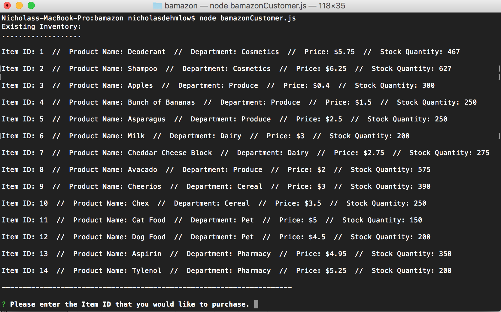
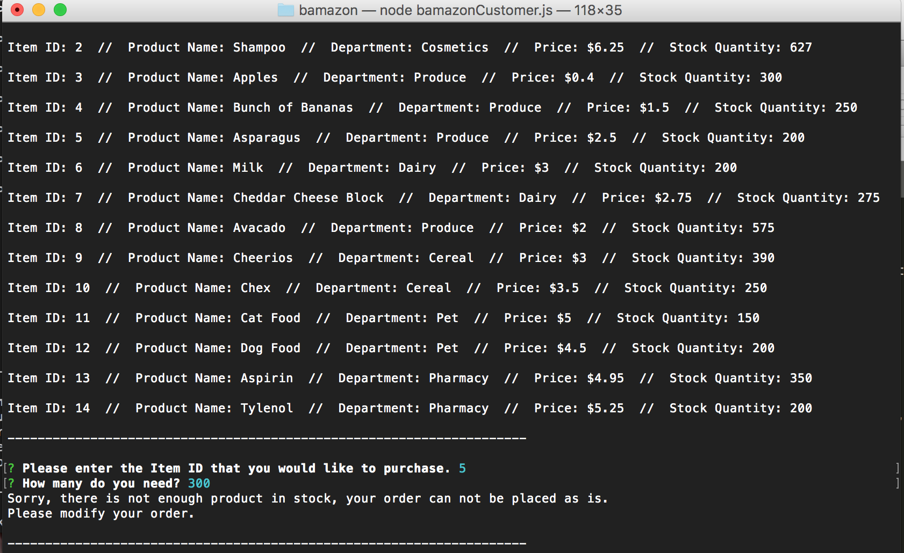
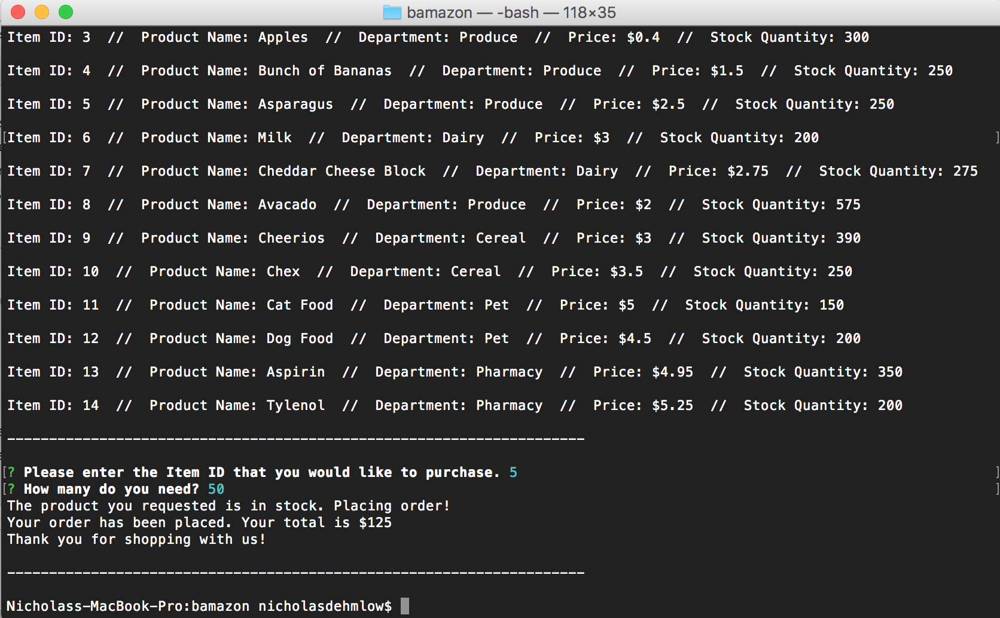
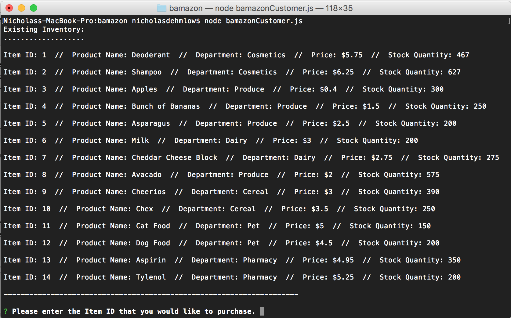

# Bamazon

## Description

This is a command line based application that utilizes the inquirer and mysql npm packages to create a mock inventory ordering system for a grocery store.

## How it Works

After installing the inquirer and mysql npm packages run the javascript file using node.

As you can see, the inventory is displayed, showing the ID number, product name, department, price, and stock quantity left.
It then asks you to enter the ID number of the item that you would like to purchase.

After entering the ID number, it then asks you how many of the item you would like to order.  Once entering that number it tells you whether or not the item is in stock.  If it is not in stock it shows you this message:

If it is in stock then it lets you know that it is in stock and what your total dollar amount owed is.

Finally, the database is updated so when you go back and check it will show the updated inventory amount:

